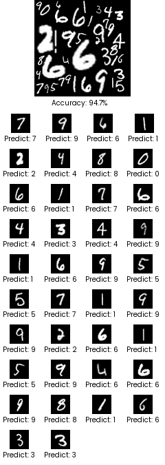

# Convolutional Neural Network and Their Application in Digit Recognition


## Overview

Welcome to my undergraduate thesis project, focused on digit recognition in images. This project consists of three main tasks, each contributing to the overall goal of identifying and recognizing handwritten digits.

### Tasks

1. **Task A: MNIST Digit Classifier**
    - Convolutional Neural Network built with PyTorch
    - Accuracy: 0.9929


2. **Task B: Equal-Sized Digit Identification using Convolution**
    
    
   *Version 1 and 2 for Task B*

    - Random placement of digits onto an image
    - Digits are maintained at their 28 x 28 pixel size
    - Digit locations identified using convolution and predictions from Task A Neural Network
    - **Task B Version 2:**
        - Crop the border of the digits to 20 x 20
        - Digits with one pixel separation
    - **Results:**
        - Task B (28 x 28):
            - 100 Images (5-10 digits per image)
            - Average Accuracy: 94.56%
        - Task B (20 x 20):
            - 100 Images (10-20 digits per image)
            - Average Accuracy: 93.66%

3. **Task C: Varying-Sized Digit Identification using Image Analysis and Clustering Algorithm**
    
    
    *Version 1 and 2 for Task C*
    
    - Random placement of digits onto an image
    - Digits can vary in size
    - Image analysis and clustering algorithm (inspired by DBScan) for digit location identification
    - **Task C Version 2:**
        - Digits can be contained within other digits with one pixel separation
        - Works for real-world scanned images
    - **Results:**
        - Task C:
            - 100 Images (17-25 digits per image)
            - Average Accuracy: 94.34%
        - Task C Version 2:
            - 100 Images (23-43 digits per image)
            - Average Accuracy: 94.29%

## Thesis

The detailed findings and analysis of this project are available in the [Thesis PDF](#). (Link to be updated once the thesis is finished)

## Getting Started
Follow these steps to run the project locally:

## Prerequisites

* [pyenv](https://github.com/pyenv/pyenv) or [Python 3.9.5](https://www.python.org/downloads/)


## Setup

### pyenv

```
pyenv install 3.11.2
```

```
pyenv local 3.11.2
```

### Virtual Environment

```
python -m venv venv
```

#### Windows

```
"venv/Scripts/activate"
```

#### Unix

```
source venv/bin/activate
```

### Packages

```
pip install -U -r requirements.txt
```

## Running Tasks
#### Task A: MNIST Digit Classifier
1. Navigate to the Model directory:

2. Run main.py:

#### Task B: Equal-Sized Digit Identification using Convolution
(Note: Task C performs at a higher quality than Task B)

1. In the analysis folder, create the following folders:
```bash
$ tree
└── dataset
    ├── 28x28
    │   ├── images
    │   └── visualization
    └── 20x20
        ├── images
        └── visualization
```
2. Check the dataset function call:

3. Open the dataset.py file and scroll to the bottom of the file.
    Use one of these function calls:
```python
dataset.generate(vary_size=False) # for version 1
dataset.generate(vary_size=False, digit_size=20) # for version 2
```
4. Open analysis/main.py and uncomment the task you would like to perform.

5. Navigate to the Analysis directory:

6. Run dataset.py:

7. Run main.py:


#### Task C: Varying-Sized Digit Identification using Image Analysis and Clustering Algorithm
1. In the analysis folder, create the following folders:
```bash
$ tree
└── dataset
    ├── nxn
    │   ├── images
    │   └── visualization
    └── nxn_inner
        ├── images
        └── visualization
```

For Version 1:

1. Open dataset.py and set vary_size to True:

```python
dataset.generate(vary_size=True) # for version 1
```
2. Navigate to the Analysis directory:

3. Run dataset.py:


For Version 2:

1. Navigate to the Analysis directory:

2. Run dataset_inner.py:


1. Open analysis/main.py and uncomment the task you would like to perform.

2. Run main.py:


To run with scanned images:

1. In the analysis folder, create the following folders:
```bash
$ tree
└── dataset
    └── scan
        ├── images
        └── visualization
```
2. Place scanned images in the images folder.

3. Open analysis/main.py and uncomment the task you would like to perform.

4. Run main.py:

## License

This project is licensed under the [MIT License](LICENSE).
